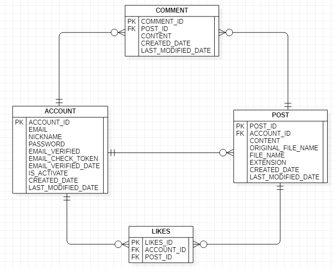

# 실행 가이드

## [maven으로 직접 실행하는 경우]

### 1. git clone

```
git clone https://github.com/zlarbals/SpringSNS.git .
```

### 2. 디렉토리 이동

```
cd backend
```

### 3. 프로젝트 BUILD

```
./mvnw clean package
```

### 4. 디렉토리 이동

```
cd target
```

### 5. 프로젝트 실행

```
java -jar springsns-0.0.1-SNAPSHOT.jar
```

<br></br>

## [docker 사용 하는 경우]

<u>아래 주의사항에서 설명하는 application-prod.yml 파일을 먼저 설정해주세요.</u>

### 1. git clone

```
git clone https://github.com/zlarbals/SpringSNS.git .
```

### 2. application-prod.yml 파일 설정

```
아래 주의사항을 보고 application-prod.yml 파일의 설정 값을 작성해주세요.
```

### 3. 디렉토리 이동

```
cd backend
```

### 4. 프로젝트 BUILD

```
./mvnw clean package
```

### 5. docker compose

```
docker compose up
```

<br></br>

## [주의사항]

### 1. maven vs docker

#### 1) maven으로 빌드한 jar 파일을 직접 실행시키는 경우

```
local 환경에서 인메모리 DB인 h2 데이터베이스를 사용하고
이메일 전송이 필요한 경우에는 실제 이메일을 전송하지 않고 해당 내용을
log를 통해 이메일 인증 및 계정 삭제에 대한 정보를 얻을 수 있다.
```

#### 2) docker를 사용하는 경우

```
prod 환경에서 SpringSNS 웹 어플리케이션의 이미지를 생성하고
관계형 DB인 mysql(version 8) 이미지와 생성된 SpringSNS 웹 어플리케이션의 이미지를 컨테이너에 각 각 올리고
docker network 기능을 사용해서 서로 통신이 가능하도록 compose 파일을 만들었다.
네이버 smtp를 사용하여 이메일 인증 및 계정 삭제에 대한 정보를 실제 사용자의 이메일로 전송해준다.

- 단 네이버 smtp 설정을 진행한 후에 application-prod.yml 파일에서
  naver id, naver password와 naver email을 직접 작성해주어야 한다.
```

<br></br>

# Policy

## 이메일 인증이 필요한 경우(이메일 인증, JWT 모두 필요한 경우)

- 게시글 등록
- 게시글 삭제(게시글 주인만 가능, 좋아요/댓글 존재할 시 삭제할 수 없음)
- 댓글 등록

<br></br>

## 로그인이 필요한 경우(JWT가 필요한 경우)

- 비밀번호 변경, 회원 탈퇴, 인증 이메일 재전송
- 특정 유저가 작성한 게시글 전체 가져오기, 게시글 검색
- 게시글 댓글 보기
- 좋아요 등록/삭제, 좋아요한 게시글 가져오기

<br></br>

## 로그인 필요 없는 경우(JWT 필요없는 경우)

- 회원 가입, 로그인, 이메일 인증
- 게시글 페이징(slice) 가져오기, 게시글에 포함된 이미지 가져오기

<br></br>

# API

## Account

|        기능        | HTTP Method |                   URI                    |   비고   |
| :----------------: | :---------: | :--------------------------------------: | :------: |
|     회원 가입      |    POST     |                 /account                 |
|   비밀번호 변경    |    PATCH    |                 /account                 | JWT 필요 |
|     회원 탈퇴      |   DELETE    |                 /account                 | JWT 필요 |
|       로그인       |    POST     |             /account/sign-in             |
|    이메일 인증     |     GET     | /account/check-email-token?email=&token= |
| 인증 이메일 재전송 |     GET     |       /account/resend-email-token        | JWT 필요 |

<br></br>

## Post

|                  기능                   | HTTP Method |            URI             |             비고             |
| :-------------------------------------: | :---------: | :------------------------: | :--------------------------: |
|               게시글 등록               |    POST     |           /post            |    JWT, 이메일 인증 필요     |
|      게시글 페이징(slice) 가져오기      |     GET     | /post?pageSize=&lastIndex= | pageSize,lastIndex 생략 가능 |
| 특정 유저가 작성한 게시글 전체 가져오기 |     GET     |  /post/account/{nickname}  |           JWT 필요           |
|     게시글에 포함된 이미지 가져오기     |     GET     |  /post/image/{imageName}   |
|               게시글 검색               |     GET     |   /post/search/{keyword}   |           JWT 필요           |
|               게시글 삭제               |   DELETE    |       /post/{postId}       |    JWT, 이메일 인증 필요     |
|        좋아요한 게시글 가져오기         |     GET     |         /post/like         |           JWT 필요           |

<br></br>

## Comment

|       기능       | HTTP Method |          URI           |         비고          |
| :--------------: | :---------: | :--------------------: | :-------------------: |
|    댓글 등록     |    POST     | /comment/post/{postId} | JWT, 이메일 인증 필요 |
| 게시글 댓글 보기 |     GET     | /comment/post/{postId} |       JWT 필요        |

<br></br>

## Like

|       기능       | HTTP Method |      URI       |   비고   |
| :--------------: | :---------: | :------------: | :------: |
| 좋아요 등록/삭제 |    POST     | /like/{postId} | JWT 필요 |

<br></br>

# ERD


